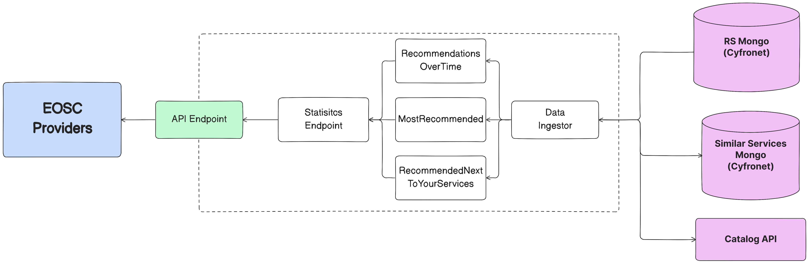

# Licence

<! --- SPDX-License-Identifier: CC-BY-4.0  -- >

## System Architecture

The system consists of 3 main components:

- **Similar services component**, responsible for calculating the similarity between the onboarding service and the rest of the services in the catalogue.
- **Tag retriever component**, responsible for retrieving tags for the onboarding service.
- **Auto-completion component**, responsible for providing the auto-completion functionality using the results of the previous two components.

Concerning persistence the system uses:

- **Catalog API** (external), which is used as a read-only API that provides access to the catalogue of services.
- **Redis** (internal), which is used to store internal structures like the text embeddings and tag corpus.

## Similar Services Component

The similar services component consists of the following sub-components:

- `TextEmbedding`, responsible for generating the text embeddings using the `SBERT` model.
- `MetadataEmbedding`, responsible for generating the metadata embeddings using one-hot encoding (**NOT USED IN AUTOCOMPLETION**).
- `TextSimilarityManager`, responsible for calculating the similarity between the onboarding service and the rest of the services in the catalogue.
- `MetadataSimilarityManager`, responsible for calculating the similarity between the onboarding service and the rest of the services in the catalogue (**NOT USED IN AUTOCOMPLETION**).
- `SimilarServicesRetriever`, responsible for retrieving the most similar services to the onboarding service based on text attributes.
- `Scheduler`, responsible for scheduling the update of the internal structures of the model (embeddings, similarities).

## Tag Retriever Component

The tag retriever component consists of the following sub-components:

- `KeywordExtractor`, responsible for extracting keywords from the onboarding service description using the `Textrank` algorithm.
- `Filtering`, responsible for filtering out non-informative keywords.
- `Mapping`, responsible for mapping the keywords to already existing tags in the corpus.
- `TagRetriever`, responsible for retrieving the most relevant tags for the onboarding service.

## Auto-completion Component

The auto-completion component consists of the following sub-components:

- `MetadataAutoCompletion`, responsible for providing auto-completion functionality for metadata fields (i.e. scientific subdomain, subcategories) using the `Similar Services` component.
- `TagAutoCompletion`, responsible for providing auto-completion functionality for tags using the `Tag Retriever` component.
- `AutoCompletion`, responsible for managing auto-completion functionality for metadata fields and tags.
- `API Endpoint`, responsible for providing the API endpoints (`fastapi`) for the auto-completion functionality.
